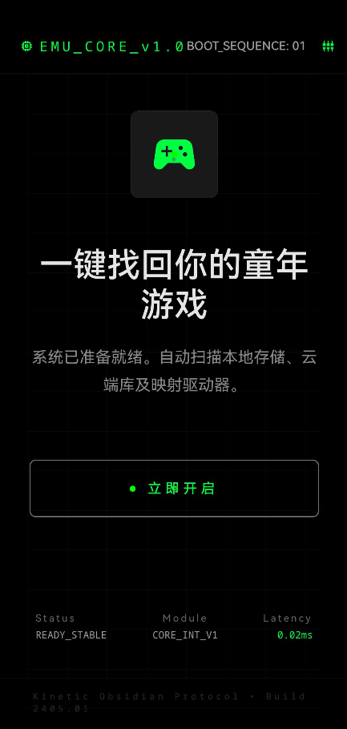
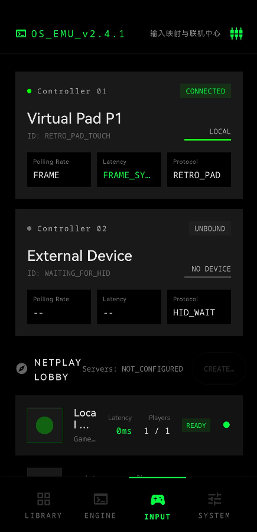
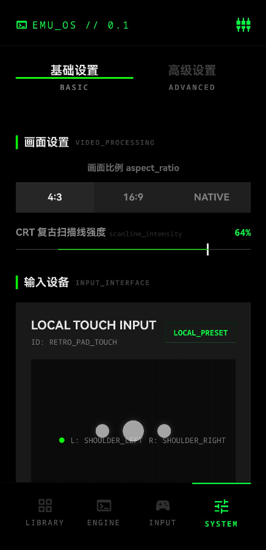

# HarmonyOS Libretro Emulator

> 面向 HarmonyOS 手机端的 Libretro 前端工程，主线架构为 `new_arch`。
> 当前 README 按仓库代码现状更新于 `2026-06-27`。

## 项目是什么

这是一个把 `ArkTS/ArkUI`、`XComponent`、`NativeWindow`、`NAPI` 和 `Libretro` 核心真正接到一起的 HarmonyOS 模拟器前端工程，不是单纯的 UI 壳，也不是只做技术验证的 demo。

主线目标有三件事：

- 把 Libretro 前端能力落到 HarmonyOS 手机端
- 保持引擎、渲染、音频、输入、状态切换这些底层链路可诊断、可恢复
- 用一个还能持续演进的工程结构，替代“一页测试页 + 一堆临时脚本”的实验形态

## 现在长什么样

| 引导页 | 输入中心 | 设置页 |
| --- | --- | --- |
|  |  |  |

更多运行截图见：
- `docs/verification/runtime-screenshots-2026-05-04/`
- `docs/2026-04-30-design-page-acceptance-matrix.md`
- `docs/archive/misc/2026-05-04-artifact-to-runtime-gap-audit.md`

## 当前主线能力

### 1. 引擎与生命周期

- 独立 `LibretroEngine` 线程
- 明确的状态机和消息队列
- `refactoredSwitchGameAsync(...)` 单飞切换、取消和失败恢复
- 最近错误信息、状态等待、统计查询

### 2. 渲染

- `VideoPipeline` 三种主路径：`Hardware / Software / GLES`
- `XComponent + NativeWindow` 视频承载
- `SET_PIXEL_FORMAT / SET_GEOMETRY / GET_CAN_DUPE` 等关键协商链路
- GLES 与 Vulkan HW Render 基础路径

### 3. 音频

- `AudioBridge` 重采样、DRC、RingBuffer、统计回传
- OHAudio 播放链路
- 音频同步模式和最小延迟协商接口

### 4. 输入与运行控制

- 数字按键、模拟摇杆、传感器、端口绑定
- 虚拟手柄和输入布局页
- Save State / SRAM / Core Options / Cheat / DiskControl

### 5. 产品层页面

- 引导页、导入入口、导入任务浮层
- 游戏库、详情页、设置页、存档页、帮助页
- 输入中心、着色器预览、运行页控制层

## 项目结构

```text
entry/src/main/cpp/
  app/                 NAPI 导出、XComponent 桥接
  core/                LibretroEngine、VideoPipeline、core loader、env
  platform/            audio / graphics / resource / sync / xcomponent

entry/src/main/ets/
  pages/               产品页与测试页
  components/          虚拟手柄、详情组件、导航组件等
  common/              EventHub、Repository、Presenter、协调器

docs/
  architecture/        稳定架构说明
  design/              设计稿与 UI 方案
  plans/               实施方案、路线图、专项计划
  verification/        验证资料与截图
  archive/             已归档历史资料

deprecated/legacy/
  旧实验链路与历史专项资料
```

## 技术架构

```text
[ArkTS/UI 线程]
页面状态 / 路由 / 交互
  -> refactored* NAPI
  -> libentry.so

[XComponent 回调线程]
Surface / 输入事件
  -> PluginManager
  -> LibretroEngine::SetNativeWindow / OnNativeWindowResized

[Engine 线程]
GameLoop + MessageQueue + StateMachine
  -> retro_run
  -> VideoPipeline::Render
  -> AudioBridge::ProcessAudio

[Audio 回调线程]
OHAudio 从 RingBuffer 读取并播放

[事件回传]
EventBridge (C++)
  -> LibretroEventHub (ArkTS)
```

## 为什么这个仓库不是“普通前端壳”

和纯 UI 模拟器壳不同，这个项目真正处理了 HarmonyOS 上最难的几类问题：

- `XComponent / NativeWindow` 生命周期
- Libretro core 加载、切换、失败恢复
- 视频路径和音频路径的线程拆分
- ArkTS 与 C++ 之间的 NAPI 契约
- 产品页状态和底层运行态之间的边界

这也是为什么仓库里会同时出现：

- `ArkTS` 页面与交互代码
- 大量 `C++` 引擎 / 平台适配代码
- 审计、验证、设计与发布资料

## 快速开始

### 环境

- DevEco Studio
- HarmonyOS SDK / Command Line Tools
- 可用的 HarmonyOS 设备或模拟器

### 本地运行

1. 用 DevEco Studio 打开工程。
2. 选择 `entry` 模块执行 Build / Run。
3. 进入导入入口或测试入口页面。
4. 导入你有合法使用权的 ROM，并选择对应 core。

### 本地静态检查

```bash
bash scripts/ci/check_repo_hygiene.sh
bash scripts/ci/check_regression_guards.sh
```

## 文档入口

- 文档总索引：`docs/README.md`
- 贡献说明：`CONTRIBUTING.md`
- 安全报告：`SECURITY.md`
- 支持说明：`SUPPORT.md`

推荐阅读顺序：

1. 本 README
2. `docs/README.md`
3. `docs/plans/2026-02-06-new-arch-technical-whitepaper.md`
4. `docs/architecture/`
5. `docs/2026-04-30-design-page-acceptance-matrix.md`

## 当前仓库约束

- 以 HarmonyOS 官方文档与 `libretro.h` 为准，不凭经验猜 API 行为
- `deprecated/legacy/` 不参与主线演进
- NativeBuffer 像素访问必须走 `FromNativeWindowBuffer + Map/Unmap`
- 图形 API 默认只在 Engine 线程执行
- 商店版不允许捆绑 ROM 样例与商业风格封面资源

## CI / 发布

当前仓库包含：

- `ci.yml`：轻量静态守卫
- `harmonyos-pr-ci.yml`：PR 构建门禁
- `harmonyos-release.yml`：`v*` tag 发布
- `harmonyos-device-deploy.yml`：手动设备部署

## 现状说明

这个项目已经不是“只有底层能跑”的阶段，但也还没到“所有 core / 所有设备 / 所有页面都完全收口”的阶段。

当前最准确的说法是：

- 底层主链路已经具备持续迭代基础
- 产品层页面已经成形并有运行态截图
- 兼容矩阵、真机覆盖、性能与长时稳定性仍在持续收敛

如果你要看“还有哪些地方没完全做完”，从这里开始：

- `Roadmap.md`
- `docs/reference/known-issues.md`
- `docs/2026-04-30-design-page-acceptance-matrix.md`

## 许可

- 仓库许可见 `LICENSE`
- 使用的 ROM、core、封面和第三方资产，必须由使用者自行确保拥有合法使用权
