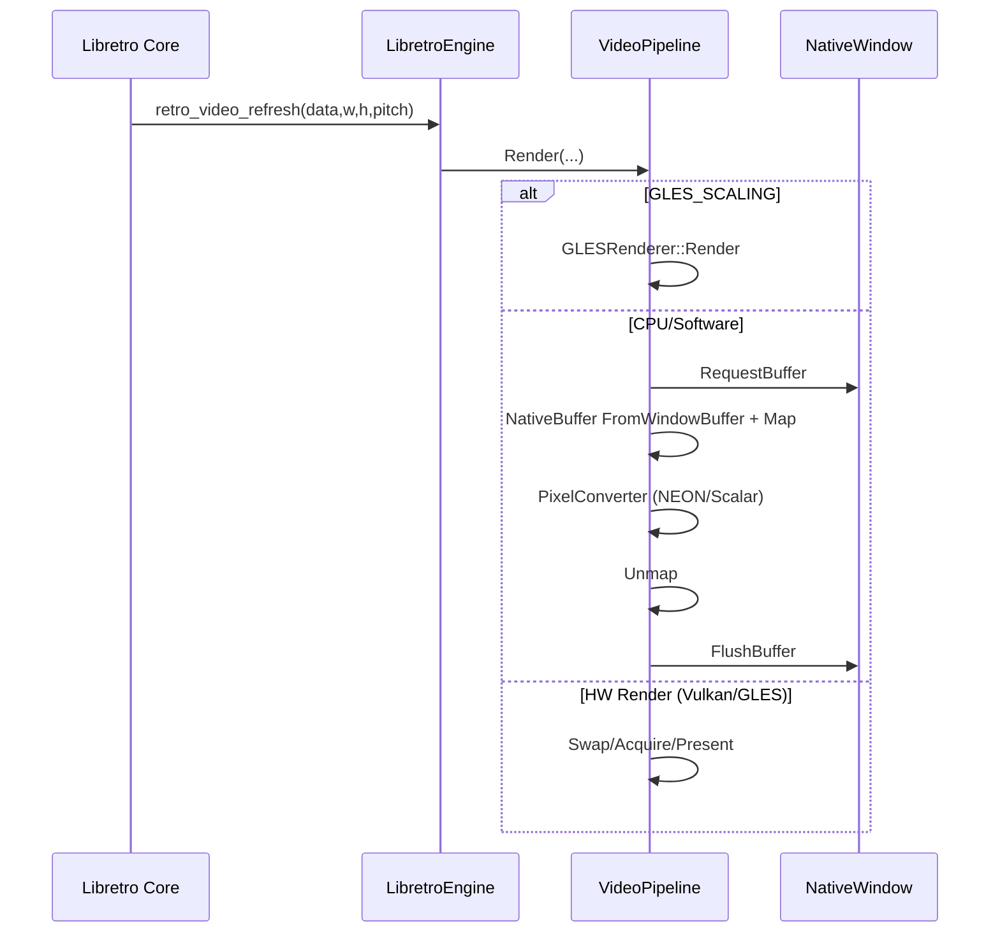

# HarmonyOS Libretro Frontend 深度技术白皮书

- 文档版本：v1.1（审阅稿）
- 日期：2026-02-06
- 主线范围：`new_arch (LibretroEngine + VideoPipeline)`
- 主线结构：**架构 → 线程 → 数据流 → 约束**

## 阅读导航

1. 想先看全局：从 `1. 架构` 与 `2. 线程` 开始。
2. 想看关键实现：直接跳到 `4. 核心模块深度解析`。
3. 想做评审/走查：重点看 `5. 约束` 与 `6. 风险面与审查重点`。

## 0. 目标与范围

本文档用于对当前仓库 `new_arch` 实现做工程级技术剖析，目标是回答四个问题：

1. 系统由哪些层组成，各层职责边界是什么。
2. 运行时涉及哪些线程，谁生产数据，谁消费数据。
3. 核心业务链路（启动、渲染、音频、输入、事件、资源）如何流动。
4. 哪些约束是必须遵守的（协议约束、平台约束、并发约束、安全约束）。

本文档基于当前代码实现抽象，不讨论 `deprecated/legacy/` 历史架构。

---

## 1. 架构（Architecture）

### 1.1 分层模型

```mermaid
flowchart TD
  A[ArkTS UI / Pages] --> B[NAPI: libentry.so]
  B --> C[LibretroEngine]
  C --> D[CoreLoader + EnvDispatcher]
  C --> E[VideoPipeline]
  C --> F[AudioBridge]
  C --> G[InputManager + InputPortRouter]
  E --> H[NativeWindow / NativeBuffer / GLES / Vulkan]
  F --> I[RingBuffer + OHAudio]
  D --> J[Libretro Core (.so)]
  C --> K[EventBridge]
  K --> L[ArkTS LibretroEventHub]
```

### 1.2 核心组件职责

1. `LibretroEngine`
- 系统主调度器，维护引擎状态机（`INIT/LOADING/RUNNING/PAUSED/ERROR...`）。
- 持有消息队列与引擎线程，负责 `LoadCore/LoadRom/ProcessFrame` 主循环。
- 汇聚渲染、音频、输入、事件桥接能力，是控制平面的中心。

2. `CoreLoader + EnvDispatcher`
- 负责 core 动态装载与 `retro_*` 函数绑定。
- 负责处理 `RETRO_ENVIRONMENT_*` 命令，包括像素格式、几何、HW Render 协商、Core Options、音频延迟等。

3. `VideoPipeline`
- 负责视频输出策略与平台窗口配置。
- 支持 `HARDWARE_SCALING / SOFTWARE_SCALING / GLES_SCALING`。
- 在 HW Render 模式下管理 GLES/Vulkan 上下文与交换链生命周期。

4. `AudioBridge`
- 连接 core 音频回调与 OHAudio 播放。
- 负责重采样、DRC 微调、同步模式（阻塞/非阻塞）、缓冲水位治理。

5. `InputManager + InputPortRouter`
- 输入状态聚合与路由（虚拟手柄、键鼠、传感器）。
- 将 ArkTS/NativeXComponent 输入映射到 Libretro `input_poll/input_state` 查询模型。

6. `EventBridge + LibretroEventHub`
- C++ 侧将事件经 TSFN 推送到 ArkTS。
- ArkTS 侧做类型化解析、回放与分发（`engine_state/core_crash/fps_update/...`）。

### 1.3 控制平面与数据平面

- 控制平面：UI 触发 NAPI -> 消息入队 -> Engine 状态迁移。
- 数据平面：
  - 视频：`retro_video_refresh -> VideoPipeline`
  - 音频：`retro_audio_sample(_batch) -> AudioBridge`
  - 输入：ArkTS/XComponent 输入写入快照 -> `OnInputState` 被 core 拉取

两者在 `LibretroEngine` 汇聚，靠状态机与锁边界保证一致性。

---

## 2. 线程（Threads）

### 2.1 线程清单

1. ArkTS/UI 线程
- 页面交互、调用 `refactored*` NAPI 接口。
- 通过 `LibretroEventHub` 接收并消费运行事件。

2. XComponent 回调线程
- 处理 `OnSurfaceCreated/Changed/Destroyed`、Touch/Mouse/Key 回调。
- 通过 `PluginManager` 将窗口与输入转发到 `LibretroEngine`。

3. Engine 线程（`LibretroEngine::GameLoop`）
- 执行消息循环与 `retro_run`。
- 运行态：先清空消息，再跑一帧；非运行态：阻塞等待消息。
- 负责状态迁移与主生命周期编排。

4. Audio 回调线程（OHAudio）
- 从 `RingBuffer` 读取音频数据。
- 缓冲不足时按策略处理（静音/统计/告警）。

5. NAPI 异步 worker 线程
- 典型场景：`refactoredSwitchGameAsync`、`refactoredWaitForStateAsync`。
- 不直接驱动渲染，而是通过 Engine 接口 + 状态等待实现串行切换。

### 2.2 并发控制对象

1. 引擎级锁与条件变量
- `controlMutex_`：Start/Stop/Load 等外部控制接口串行化。
- `windowMutex_`：`window_` 与窗口尺寸快照保护。
- `renderMutex_`：渲染资源与 VideoPipeline 关键路径保护。
- `stateMutex_ + stateCond_`：`WaitForState` 等待机制。
- `stopMutex_ + stopCond_`：停机等待。
- `statsMutex_`：运行统计写入/读取。
- `errorMutex_`：最近错误信息保护。

2. 事件桥锁
- `EventBridge::mutex_` 保护 TSFN、节流状态、合并队列。

3. 输入路由锁
- `InputPortRouter::mutex_` 保护端口绑定、设备表。

4. 音频缓冲控制
- `RingBuffer` 采用原子 head/tail + 条件变量混合模型（SPSC 场景）。

### 2.3 线程模型要点

1. Engine 线程是唯一 `retro_run` 执行点。
2. 窗口生命周期事件由回调线程生产，Engine 线程消费并应用。
3. 资源初始化/销毁优先在 Engine 渲染锁边界内完成，避免跨线程图形上下文操作。
4. 高频事件采用“合并/节流”机制（消息合并、EventBridge coalesce）。

---

## 3. 数据流（Data Flow）

### 3.1 启动与切换链路（SwitchGameAsync）

`refactoredSwitchGameAsync(corePath, romPath, filesDir, ...)` 关键步骤：

1. 分配/校验 token，形成“最新请求优先”的单飞语义。
2. 若 ROM 为 `roms/...`，先走 rawfile 装载，必要时落地临时文件。
3. 异步 worker 内按顺序执行：
- 停旧引擎并等待 `STOPPED`。
- `Start()`。
- `SetFilesDir()`。
- `LoadCore()` 并等待 `CORE_LOADED`。
- `LoadGame()` 并等待 `RUNNING`。
4. 任一步失败都触发恢复：`Stop -> Wait STOPPED -> Reset`。

这条链路的关键价值是：避免 UI 高频点击造成状态穿透与并发切换崩溃。

### 3.2 视频数据流



关键实现点：

1. CPU 路径严格走 `FromNativeWindowBuffer -> Map -> Unmap`。
2. 请求失败、Fence 超时、Map/Unmap 失败都计入指标并触发丢帧路径。
3. `geometry_changed_` 作为窗口重配置触发器，避免每帧重设窗口参数。
4. HW Render 与窗口生命周期联动（Create/Resize/Destroy）。

### 3.3 音频数据流

1. core 调用 `OnAudioSampleBatch`。
2. `AudioBridge::ProcessAudio` 执行：
- 采样率处理（必要时重采样）。
- 根据同步模式写入 `RingBuffer`（阻塞/非阻塞）。
- DRC 水位调节、统计更新。
3. OHAudio 回调线程从 RingBuffer 读数据播放。
4. 引擎周期性上报 `audio_status`（occupancy/underrun/overrun）。

### 3.4 输入数据流

1. ArkTS 虚拟手柄/NAPI 调用 `refactoredSendInput/refactoredSendAnalog`。
2. XComponent Touch/Mouse/Key 在 `PluginManager` 归一化后转为 `SendPointer/SendInput`。
3. `InputManager` 写入输入快照。
4. core 在 `input_poll/input_state` 回调中主动读取。

这是典型“写入快照 + 被动拉取”模型，匹配 libretro 前端语义。

### 3.5 事件数据流

1. C++ 侧 `eventBridge_.Emit(event, payload, force)`。
2. `EventBridge` 做节流/合并/背压保护后经 TSFN 回调 ArkTS。
3. ArkTS `LibretroEventHub` 做 JSON 解析、类型化、订阅分发、状态事件回放。

事件集合包含：
- `engine_state`
- `core_crash`
- `fps_update`
- `audio_status`
- `geometry_update`
- `pixel_format_update`
- `options_update`
- `core_message`
- `disk_control`
- `rumble`
- `sensor_state`

### 3.6 资源与 ROM 数据流

1. UI 传入 `romPath`：
- rawfile 路径（`roms/...`）
- 沙箱路径（绝对路径）
2. rawfile 路径经 `RawfileRomProcessor`：
- 读取资源数据
- 尝试写入 `files/temp_roms`
- 若是 `.cue`，解析依赖并落地配套文件
3. Engine `LoadRom` 阶段按 core `need_fullpath` 策略决定传路径还是传内存数据。
4. `security::ValidateRomPath` 校验路径合法性并阻断越界访问。

---

## 4. 核心模块深度解析（LibretroEngine / AudioBridge / VideoPipeline）

本章聚焦三个主线模块的内部机制，重点讨论：设计目标、关键路径、并发策略、异常处理、性能观测点。

<a id="libretroengine"></a>
### 4.1 LibretroEngine 深度解析

#### 4.1.1 设计定位

`LibretroEngine` 是整个前端的“控制中枢 + 生命周期编排器”，它同时承担：

1. 状态机维护（`INIT -> LOADING -> CORE_LOADED -> GAME_LOADED -> RUNNING ...`）。
2. 消息驱动调度（`MessageType` 队列统一入口）。
3. core 回调桥接（video/audio/input/environment）。
4. 与平台层模块协同（VideoPipeline、AudioBridge、InputManager、EventBridge）。

核心目标是把 UI 线程、XComponent 回调线程、core 回调三类异步来源，收敛到一个可推理的执行序列。

#### 4.1.2 对外接口面（NAPI/Engine API）

`LibretroEngine` 对外暴露的是“动作 + 等待 + 查询”三类能力：

1. 动作类：`Start`、`Stop`、`LoadCore`、`LoadGame`、`Pause`、`Resume`、`Reset`。
2. 等待类：`WaitForState`（供切换链路和异步接口做阶段同步）。
3. 查询类：运行状态、错误信息、统计信息、当前 AV 配置。

设计原则：动作接口不直接做重活，统一转为消息入队，由 Engine 线程串行执行。

#### 4.1.3 调度模型

`GameLoop` 是单线程循环，采用“双态调度”：

1. `RUNNING` 态：先非阻塞清空队列，再执行 `ProcessFrame`。
2. 非 `RUNNING` 态：`WaitAndPop` 阻塞等待消息。

这个设计的意义：

1. 运行时保持对控制消息（Pause/Stop/Resize）的高响应。
2. 空闲时零轮询，避免无意义 CPU 消耗。
3. 所有状态跃迁集中在 `HandleMessage + TransitionTo`，可追踪性强。

#### 4.1.4 状态与错误模型

1. 所有状态切换经过 `TransitionTo`，非法迁移会被拒绝并记录日志。
2. 失败路径统一走 `SetLastErrorInfo(reason, step, message)`，并通过 `core_crash` 事件上报。
3. `WaitForState` 提供跨线程同步观察点（切换链路、异步等待都依赖它）。

这使得“失败原因可回放、状态可等待、恢复逻辑可串行”成为可能。

#### 4.1.5 并发与锁边界

当前关键锁职责分离清晰：

1. `controlMutex_`：控制接口串行化（Start/Stop/Load）。
2. `windowMutex_`：NativeWindow 指针与窗口尺寸快照。
3. `renderMutex_`：VideoPipeline 与图形资源临界区。
4. `stateMutex_`：条件变量等待。
5. `statsMutex_` / `errorMutex_`：统计与错误信息。

实践上形成“控制面锁”和“数据面锁”分离，减少互相阻塞。

#### 4.1.6 核心数据流（消息驱动）

1. UI/NAPI 线程发起动作 -> Engine 接口参数校验 -> 消息入队。
2. Engine 线程 `HandleMessage` 执行动作 -> 更新状态机 -> 触发事件回传。
3. 运行态中，`ProcessFrame` 拉动 core，一帧内完成 video/audio/input 三回调交互。
4. 异步切换时，以 `WaitForState` 阶段栅栏防止“前一步未收敛就进入下一步”。

#### 4.1.7 不变量（必须保持）

1. 任何时刻只允许一个 Engine 线程执行 `retro_run`。
2. 任何状态迁移必须可解释（有前置状态、触发事件、失败回退路径）。
3. 任何失败路径都必须可回读（`reason/step/message`）。
4. `Stop` 结束后必须回到可重入状态（可再次 `Start/Load`）。

#### 4.1.8 关键风险点

1. 窗口生命周期抖动时（Create/Destroy 高频）需要严格遵守 window/render 锁边界。
2. `retro_run` 内回调可能触发环境命令，必须保证事件上报和状态更新不反向阻塞主循环。
3. 切换路径（SwitchGameAsync）超时恢复必须始终可回到 `STOPPED/INIT` 可重入状态。

<a id="audiobridge"></a>
### 4.2 AudioBridge 深度解析

#### 4.2.1 设计定位

`AudioBridge` 是 core 音频回调和 OHAudio 播放线程之间的“时钟域转换层”。它要同时解决：

1. 采样率不一致（core rate 与输出 rate）。
2. 生产-消费速率波动（帧抖动、系统调度抖动）。
3. 低延迟与稳定性的矛盾（追求低缓冲但避免爆音）。

#### 4.2.2 对外接口面

1. `Reset(sampleRate)`：在 core AV 参数切换后重建音频处理链。
2. `ProcessAudio(samples, frames)`：核心音频写入入口。
3. `GetStats/GetStatus`：输出缓冲占用、underrun/overrun、写入丢弃等观测指标。

接口策略：调用方不关心内部重采样与 DRC 细节，统一按“提交 PCM + 读取状态”使用。

#### 4.2.3 音频链路分层

1. 输入层：`OnAudioSampleBatch` 接收 core 样本。
2. 处理层：`ProcessAudio` 执行重采样、DRC、写入策略选择。
3. 缓冲层：`RingBuffer`（SPSC）承接线程解耦。
4. 输出层：`AudioPlayer` / OHAudio 回调持续读取并播放。

关键点是：写端和读端都可独立推进，靠 buffer 水位调节来维持稳定。

#### 4.2.4 同步策略

`AudioBridge` 支持两种同步模式：

1. `AUDIO_BLOCKING`：写满时阻塞等待空间，优先“实时同步”。
2. `NON_BLOCKING`：写满时丢弃，优先“不卡主链路”（类似 fast-forward 行为）。

另有 `buffering_` 逻辑：启动初期先攒到最小水位再正式播放，降低开播瞬时爆音概率。

#### 4.2.5 DRC 与稳定性机制

DRC 通过缓冲占用（目标约 50%）微调重采样比率（`drc_skew_`）：

1. 水位偏低：略增速补充缓冲。
2. 水位偏高：略降速释放压力。
3. 调整步长小、更新节流，避免音高明显漂移。

这是一种“保守闭环控制”：优先稳定，次优延迟。

#### 4.2.6 线程交互与不变量

1. 写线程（Engine/core 回调）只能追加样本，不能直接操作播放设备对象。
2. 读线程（OHAudio 回调）只能消费 RingBuffer，不能回调 core。
3. 重置路径必须“先切流再换缓冲”，避免读写跨代缓冲。
4. 任何时刻都允许短时静音，但不允许崩溃或死锁。

#### 4.2.7 故障恢复策略

1. 欠载（underrun）：优先补静音，持续上报计数。
2. 过载（overrun）：按模式阻塞或丢弃，禁止反向拖垮主循环。
3. 设备异常：通过状态事件向上层暴露，允许 UI 侧提示或触发降级。

#### 4.2.8 关键风险点

1. `Reset/Stop` 与 `ProcessAudio` 并发时要保证 RingBuffer 生命周期安全（当前通过 `shared_ptr` 快照规避悬挂引用）。
2. 阻塞写策略在极端负载下可能放大延迟，需结合场景调参。
3. DRC 参数若配置激进，会出现可感知音调变化或水位振荡。

<a id="videopipeline"></a>
### 4.3 VideoPipeline 深度解析

#### 4.3.1 设计定位

`VideoPipeline` 是“渲染策略层 + 平台窗口适配层”，不是单纯绘制器。它统一处理：

1. 渲染模式选择（Hardware/Software/GLES）。
2. 窗口状态配置与重配置。
3. HW Render 上下文生命周期（GLES/Vulkan）。
4. 渲染失败退化与统计采集。

#### 4.3.2 对外接口面

1. `Render(frame, width, height, pitch)`：每帧渲染入口。
2. `SetScalingMode/SetSoftwareMaxWidth`：运行期策略调节。
3. `OnWindowCreated/Changed/Destroyed`：窗口生命周期同步入口。
4. `GetRenderStats`：暴露 request/map/unmap/flush/fence 维度统计。

接口原则：窗口事件与帧渲染分离，保证配置变更和实时渲染互不污染。

#### 4.3.3 模式语义

1. `HARDWARE_SCALING`：依赖系统缩放，代价低，画质受平台策略影响。
2. `SOFTWARE_SCALING`：CPU 转换 + 缩放，控制力高但 CPU 压力大。
3. `GLES_SCALING`：GPU 纹理路径，当前主推荐模式。

在工程上，模式切换不是“渲染函数切换”这么简单，还涉及窗口 usage/scaling/source 参数联动和资源重置。

#### 4.3.4 CPU 渲染路径（关键约束路径）

CPU 路径完整顺序：

1. `RequestBuffer`
2. `FromNativeWindowBuffer`
3. `Map`
4. PixelConverter（NEON/Scalar）
5. `Unmap`
6. `FlushBuffer`

其中任何一步失败都触发丢帧，且累计指标（request/map/unmap/flush/fence）用于后续诊断。

#### 4.3.5 GLES/Vulkan 路径

1. GLES：维护 surface 健康状态，swap 异常时进入 `SURFACE_LOST`，等待重建。
2. Vulkan：负责上下文初始化、acquire/present、out-of-date 处理与 swapchain 重建。
3. HW Render 初始化与销毁均绑定窗口生命周期消息，避免脏上下文复用。

#### 4.3.6 线程与资源所有权

1. EGL/GL/Vulkan 操作只在 Engine 线程执行。
2. XComponent 回调线程只更新窗口事件，不直接执行渲染 API。
3. 窗口对象与图形资源要么同代有效，要么整代作废重建，禁止“半代复用”。

#### 4.3.7 节流与退化策略

1. 窗口参数重配由 `geometry_changed_` 触发，避免每帧 HandleOpt。
2. 渲染失败默认“丢帧而非阻塞”，优先维持系统活性。
3. 与 Engine 的音频保护策略联动（音频低水位允许主动跳帧）。

#### 4.3.8 故障恢复策略

1. `SURFACE_LOST`：暂停 GPU 呈现，等待窗口恢复后重新绑定资源。
2. `VK_ERROR_OUT_OF_DATE_KHR`：触发 swapchain 重建，不中断引擎主循环。
3. CPU Map/Flush 失败：只丢当前帧并累加指标，禁止 crash。

#### 4.3.9 关键风险点

1. 高速旋转/前后台切换下，窗口与渲染资源状态同步是主要崩溃面。
2. Software 模式在高分辨率目标下容易成为瓶颈，需谨慎使用。
3. Vulkan 协商成功不代表所有 core 均稳定，仍需核心级兼容矩阵。

---

## 5. 约束（Constraints）

### 5.1 协议约束（Libretro）

1. `retro_run` 必须由 Engine 线程串行调用。
2. `RETRO_ENVIRONMENT_SET_MINIMUM_AUDIO_LATENCY` 仅在 `retro_run` 上下文有效；否则拒绝。
3. `SET_HW_RENDER` / `GET_HW_RENDER_INTERFACE` / Vulkan negotiation 的调用时序要与 core 协商一致。
4. `need_fullpath` core 不可传内存 ROM 数据替代路径。

### 5.2 平台约束（HarmonyOS 图形/窗口）

1. NativeWindow Buffer 像素访问必须走：
- `OH_NativeBuffer_FromNativeWindowBuffer`
- `OH_NativeBuffer_Map`
- `OH_NativeBuffer_Unmap`
2. 禁止对 BufferHandle 直接 `mmap/munmap`。
3. Surface 生命周期不稳定窗口期必须可丢帧，不能强行渲染。
4. 窗口参数重配置应事件驱动，避免每帧重复设置。

### 5.3 并发与同步约束

1. 跨线程共享状态必须在统一锁边界访问（窗口、渲染、状态、统计、错误）。
2. `SwitchGameAsync` 必须遵守 token 单飞，禁止并发链路交叉写状态。
3. 高频窗口 resize/事件需要合并策略，防止队列膨胀与抖动。
4. 停机路径必须等待明确状态（`STOPPED`）后再恢复/重置。

### 5.4 资源与安全约束

1. core 路径、ROM 路径受白名单根目录约束。
2. rawfile 相对路径需拒绝 `..` 路径穿越。
3. CUE 依赖文件名必须清洗并约束在临时目录。
4. `filesDir` 在 core 已加载后不应被动态改写（当前实现已拒绝）。

### 5.5 性能与稳定性约束

1. 视频路径必须允许丢帧（RequestBuffer/Fence/Map/Flush 异常均可降级）。
2. 音频优先稳定性：低水位时允许跳帧保护，避免长时间爆音。
3. 事件桥必须限流与背压，避免 TSFN 队列打满导致级联阻塞。
4. 统计采样要节流，防止日志本身成为性能瓶颈。

### 5.6 日志与可观测约束

1. 日志域使用 `0xD000-0xFFFF` 区间。
2. 结构化事件 payload 保持 JSON 对象语义，ArkTS 侧严格解析。
3. 崩溃/失败路径必须带 `reason/step/message` 以支持 UI 与排障闭环。

### 5.7 架构演进约束

1. `deprecated/legacy/` 不作为主线设计参考。
2. 新功能优先进入 `new_arch` 统一链路（EventBridge/InputManager/VideoPipeline）。
3. 不允许破坏现有状态机不变量（非法状态迁移已在引擎侧保护）。

---

## 6. 风险面与审查重点（供评审）

1. 锁顺序一致性
- 核查 `windowMutex_` 与 `renderMutex_` 的组合使用是否存在反序路径。

2. 切换恢复的可证明性
- 核查 `SwitchGameAsync` 在超时/取消/并发点击下是否总能回到可重入状态。

3. HW Render 生命周期
- 核查 Surface destroy + recreate + resize 高频序列是否触发资源泄漏或脏引用。

4. 音视频时钟一致性
- 核查低端机长时运行下 A/V 漂移和缓冲抖动是否可控。

5. 事件背压策略
- 核查 TSFN 队列满载时“丢弃/合并/强制事件”策略是否满足产品需求。

---

## 7. 关键代码索引

- 引擎主调度：`entry/src/main/cpp/core/engine/libretro_engine.cpp`
- 引擎接口定义：`entry/src/main/cpp/core/engine/libretro_engine.h`
- 视频管线：`entry/src/main/cpp/core/engine/video_pipeline.cpp`
- 环境命令分发：`entry/src/main/cpp/core/libretro/env_dispatcher.cpp`
- NAPI 入口与切换：`entry/src/main/cpp/app/napi/libretro_engine_napi.cpp`
- XComponent 桥接：`entry/src/main/cpp/app/framework/plugin_manager.cpp`
- 音频桥接：`entry/src/main/cpp/platform/audio/audio_bridge.cpp`
- 输入管理：`entry/src/main/cpp/core/engine/input_manager.cpp`
- C++ 事件桥：`entry/src/main/cpp/core/engine/event_bridge.cpp`
- ArkTS 事件总线：`entry/src/main/ets/common/LibretroEventHub.ets`

---

## 8. 联网调研收敛结论（2026-02-06）

> 本章将内容收敛为两类：`可验证事实` 与 `基于事实的推断`。

### 8.1 可验证事实（官方来源）

1. libretro 将体系拆成 `frontend` 与 `core`，核心负责主程序，前端负责 A/V/Input 与生命周期。
2. RetroArch 是官方参考前端，通常最先跟进 libretro 新能力。
3. RetroArch 低延迟官方工具链是组合式：Latency 相关配置 + Run-Ahead + 渲染/音频驱动调优。
4. Run-Ahead 依赖 SaveState，并且随 ahead 帧数上升带来额外 CPU 成本。
5. Harmony 图形链路提供 `RequestBuffer -> FlushBuffer` 的生产消费模型，以及 `Surface Created/Changed/Destroyed` 生命周期回调。
6. `OH_NativeBuffer_Map/Unmap`、`OH_NativeBuffer_FromNativeWindowBuffer`、`OH_NativeVSync_RequestFrame` 均为官方能力；其中 NativeBuffer 相关接口文档标注为非线程安全。

### 8.2 基于事实的推断（针对本项目）

1. 推断：本项目不应复制“通用型大前端”路径，而应继续走“HarmonyOS 平台特化前端内核”路径。
2. 推断：短期最高收益不在“加更多功能”，而在“统一时钟 + 提高恢复确定性 + 建立兼容矩阵”。
3. 推断：Run-Ahead 只能作为可选能力，不应默认开启；应受 core 能力与设备余量双重约束。
4. 推断：虽然部分 OpenHarmony 示例存在 `mmap` 路径，但本项目应坚持既定约束：像素访问统一走 `NativeBuffer FromWindowBuffer + Map/Unmap` 流程。

### 8.3 同类对比（收敛版）

| 项 | RetroArch | Lemuroid | 本项目 |
| --- | --- | --- | --- |
| 核心策略 | 功能与平台覆盖优先 | 易用优先 | 可控性与可恢复性优先 |
| 低延迟策略 | 工具链完整、可深调 | 默认体验优先 | 已有基础，待工程化闭环 |
| 适配深度 | 跨平台抽象强 | Android 深度集成 | Harmony NDK/XComponent 深度集成 |

### 8.4 落地路线（只保留三件事）

1. `P0`：统一时钟源
- 以 `OH_NativeVSync_RequestFrame` 驱动帧节拍。
- 将 frame-time、drop-frame、audio occupancy 纳入同一时间轴上报。

2. `P1`：建立能力矩阵
- 按 core 建立标签：`HW_RENDER`、`SAVE_STATE_COST`、`AUDIO_DRIFT_RISK`。
- 启动时按 `device + core` 自动选择渲染模式与音频策略。

3. `P2`：受控低延迟模式
- 增加 `稳定优先 / 延迟优先` 档位。
- Run-Ahead 仅在“SaveState 稳定 + 性能余量足”时可启用。

### 8.5 验收阈值（第一版）

1. 切换恢复：`SwitchGameAsync` 异常路径恢复成功率 >= 99%。
2. 音频稳定：长时运行无持续爆音，underrun 指标可观测且可回归。
3. 画面连续：窗口生命周期扰动场景下，黑屏恢复时延可量化下降（看 P95）。
4. 输入响应：`延迟优先` 档位较 `稳定优先` 档位有可复现的响应改善。

---

## 9. 参考来源（在线）

1. OpenHarmony NativeBuffer 指南（raw）  
`https://gitee.com/openharmony/docs/raw/master/en/application-dev/graphics/native-buffer-guidelines.md`
2. OpenHarmony NativeWindow 指南（raw）  
`https://gitee.com/openharmony/docs/raw/master/en/application-dev/graphics/native-window-guidelines.md`
3. OpenHarmony NativeVSync 指南（raw）  
`https://gitee.com/openharmony/docs/raw/master/en/application-dev/graphics/native-vsync-guidelines.md`
4. HarmonyOS `native_buffer.h` 参考  
`https://developer.huawei.com/consumer/cn/doc/harmonyos-references/capi-native-buffer-h`
5. HarmonyOS XComponent 指南  
`https://developer.huawei.com/consumer/cn/doc/harmonyos-guides/napi-xcomponent-guidelines`
6. Libretro 开发总览  
`https://docs.libretro.com/development/libretro-overview/`
7. Libretro 前端列表  
`https://docs.libretro.com/development/frontends/`
8. Libretro 延迟指南  
`https://docs.libretro.com/guides/latency/`
9. Libretro Run-Ahead 指南  
`https://docs.libretro.com/guides/runahead/`
10. RetroArch 仓库  
`https://github.com/libretro/RetroArch`
11. Lemuroid 仓库  
`https://github.com/Swordfish90/Lemuroid`
